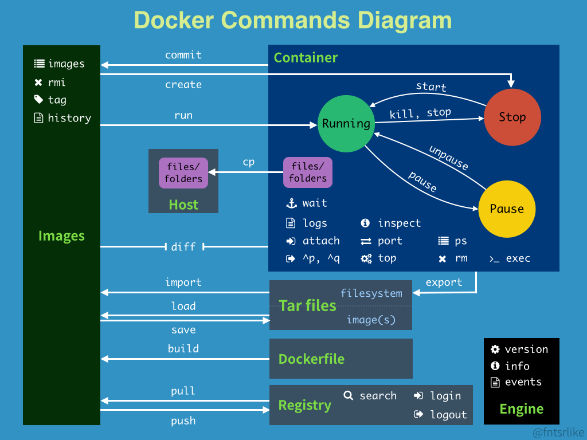

### 基础知识


**镜像（image）**

docker镜像就好比一个模板，可以通过这个模板来创建容器服务，tomcat镜像=>run=>tomcat01容器（提供服务器），通过这个镜像可以创建多个容器（最终服务运行或者项目运行就是在在容器中的）。

**容器（container）**

docker利用容器技术，独立运行一个或者一个组应用，通过镜像来创建的。

启动，停止，删除，基本命令！

目前可以把这个容器理解为一个简易的linux系统

**仓库（repository）**

仓库就是存放镜像的地方！

仓库分为公有仓库和私有仓库

Docker Hub(默认是国外的)

阿里云...都有容器服务器（配置镜像加速！）

**Docker运行的基本流程**

1. 用户是使用Docker Client与Docker Daemon建立通信，并发送请求给后者
2. Docker Daemon作为Docker架构中的主体部分，首先提供Docker Server的功能使其可以接受Docker Client请求
3. Docker Engine执行Docker内部的一系列工作，每一项工作都是以一个Job的形式存在
4. Job运行的过程中，当需要容器镜像时，则从Docker Registry中下载镜像，并通过镜像管理驱动Graph driver将下载镜像以Graph的形式存储
5. 当需要为Docker创建网络环境时，通过网络管理驱动Network driver创建并配置Docker容器网络环境
6. 当需要限制Docker运行资源或执行用户指令等操作时，则通过Exec driver来完成
7. Libcontainer是一项独立的容器管理包，Network driver以及Exec driver都是通过Libcontainer来实现具体对容器进行的操作

### 安装docker

```bash
#查看系统版本
uname -r
#系统版本
cat /etc/os-release
```

```bash
#1.卸载旧的文档
yum remove docker \
           docker-client \
           docker-client-latest \
           docker-common \
           docker-latest \
           docker-latest-logrotate \
           docker-logrotate \
           docker-engine
#2.需要的安装包
yum install -y yum-utils
#3.设置镜像的仓库
yum-config-manager \
    --add-repo \
    https://download.docker.com/linux/centos/docker-ce.repo  #默认是国外的
    http://mirrors.aliyun.com/docker-ce/linux/centos/docker-ce.repo  #推荐用阿里镜像
#更新yum软件包索引
yum makecache fast
#4.安装docker相关的内容   docker-ce 社区版（推荐）  ee 企业版
yum -y install docker-ce docker-ce-cli containerd.io
#5.启动docker
sudo systemctl start docker
#6.使用docker version 测试是否安装成功
docker version
#7.hello-world
sudo docker run hello-world
#8.查看一下下载的hello-world镜像
docker images

#卸载docker
#1.卸载依赖
yum remove docker-ce docker-ce-cli containerd.io
#2.删除资源
rm -rf /var/lib/docker
```


### Docker的常用命令

#### 帮助命令

```bash
#显示docker的版本信息
docker version 
#启动
systemctl start docker
#停止
systemctl stop docker
#重启
systemctl restart docker
#查看docker状态
systemctl status docker
#开机启动
systemctl enable docker
#查看docker概要信息
docker info
#查看docker总体帮助文档
docker --help
#查看docker命令帮助文档
docker 具体命令 --help
```

#### 镜像命令

```shell
#查看所有本地的主机上的镜像
docker images 
	-a,--all #列出所有镜像
	-q,--quiet #只显示镜像的id

#搜索镜像 docker search mysql，从dockerhub或阿里云镜像查询
docker search 镜像名称
	--dilter=stars=3000 #搜索出来的镜像就是stars大于3000的
	--limit N #只列出N个镜像，默认25个，docker search --limit 5 redis

#下载镜像 docker pull mysql 
docker pull 镜像名[:tag] # 下载对应版本的镜像

#查看镜像/容器/数据卷所占的空间
docker system df

#删除镜像
docker rmi 
	-f 镜像id... #删除指定的镜像
	-f 镜像名1:TAG 镜像名2:TAG #删除多个
	-f $(docker images -aq) #删除全部的镜像
```

#### 容器命令

有了镜像才可以创建容器

``` shell
#新建容器并启动
docker run [OPTIONS] IMAGE [COMMAND][ARG...]
#OPTIONS说明
--name="容器新名字"  为容器指定一个名称
-d：后台运行容器并返回容器ID，也即启动守护式容器（后台运行）

-i：以交互模式运行容器，通常与-t同时使用
-t：为容器重新分配一个伪输入终端，通常与-i同时使用
也即启动交互式容器（前台有伪终端，等待交互）

-P：随机端口映射
-p：指定端口映射
    -p ip:主机端口:容器端口
    -p 主机端口:容器端口（常用）
    -p 容器端口

#列出所有的运行的容器
docker ps  #列出当前正在执行的容器
    -a：列出当前正在执行的容器+历史运行过的容器
    -l：显示最近创建的容器
    -n N：显示最近创建过的N个容器
    -q：静默模式，只显示容器的编号

#退出容器
exit  #直接容器停止并退出
Ctrl+P+Q  #容器不停止退出

#启动和停止容器的操作
docker start 容器id或者容器名  #启动容器
docker restart 容器id或者容器名  #重启容器
docker stop 容器id或者容器名  #停止当前正在运行的容器
docker kill 容器id或者容器名  #强制停止当前容器

#删除容器
docker rm 容器id  #删除指定的容器，不能删除正在运行的容器，如果要强制删除 rm -f
docker rm -f $(docker ps -aq)  #删除所有的容器
docker ps -a -q|xargs docker rm  #删除所有的容器

#常用其他命令
#后台启动容器
docker run -d 镜像名  
#常见的坑：docker容器使用后台启动运行，就必须要有一个前台进程，docker发现没有应用，就会自动停止

#查看日志
docker logs -f -t --tail 容器，没有日志
-tf  #显示日志
--tail number #显示日志条数

#查看容器内运行的进程
docker top 容器id

#查看容器内部细节
docker inspect 容器id

#进入当前正在运行的容器
#方式一
docker exec -it 容器id #进入容器后开启一个新的终端，并且可以启动新的进程，用exit退出，不会导致容器的停止（常用）
#方式二
docker attach 容器id  #进入容器正在运行的终端，不会启动新的进程，用exit退出，会导致容器的停止

#从容器内拷贝文件到主机上
docker cp 容器id:容器内路径 目的主机路径

#导入和导出容器
docker export 容器ID > 文件名.tar #导出容器的内容流作为一个tar归档文件
cat 文件名.tar | docker import - 镜像用户/镜像名:镜像版本号 #从tar包中的内容创建一个新的文件系统再导入为镜像
```



### Docker镜像

#### 镜像是什么

镜像是一种轻量级、可执行的独立软件包，用来打包软件运行环境和基于运行环境开发的软件，它包含运行某个软件所需的所有内容，包括代码、运行时、库、环境变量和配置文件。

所有的应用，直接打包docker镜像，就可以直接跑起来

如何得到镜像：

+ 从远程仓库下载
+ 朋友拷贝给你
+ 自己制作一个镜像DockerFile

#### docker镜像加载原理

**UnionFS(联合文件系统)**

我们下载时看到的一层一层的就是这个

UnionFS(联合文件系统)：Union文件系统是一种分层、轻量级并且高性能的文件系统，它支持对文件系统的修改作为一次提交来一层层叠加，同时可以将不同目录挂载到同一个虚拟文件系统下。Union文件系统是Docker镜像的基础，镜像可以通过分层来进行继承，基于基础镜像（没有父镜像），可以制作各种具体的应用镜像。

特性:一次同时加载多个文件系统，但从外面看起来，只能看到一个文件系统，联合加载会把各层文件系统叠加起来，这样最终的文件系统会包含所有底层的文件和目录

**Docker镜像加载原理**

docker镜像实际上由一层一层的文件系统组成，这种层级的文件系统UnionFS。

**bootfs（boot file system）**主要包含bootloader和kernel,bootloader主要是引导加载kernel，Linux刚启动时会加载bootfs文件系统，在docker镜像的最底层是bootfs.这一层与我们典型的linux/unix文件系统是一样的，包含boot加载器和内核。当boot加载完成之后整个内核就都在内存中了，此时内存的使用权以由bootfs转交给内核，此时系统也会卸载bootfs.

**rootfs(root file system)**,在bootfs之上。包含的就是典型Linux系统中的/dev,/proc,/bin,/etc等标准目录和文件。rootfs就是各种不同的操作系统发行版，比如Ubuntu,Centos等等

平时我们安装进虚拟机的Centos都是好几个G，为什么Docker这里才200M?

对于一个精简的OS，rootfs可以很小，只需要包含最基本的命令，工具和程序库就可以了，因为底层直接用host的kernel，自己只需要提供rootfs就可以了。由此可见，对于不同的Linux发行版，bootfs基本上一致的，rootfs会有差别，因此不同的发行版可以公用bootfs.

Docker的镜像层都是只读的，容器层是可写的。当容器启动时，一个新的可写层被加载到镜像的顶部。这一层通常被称为容器层，容器层之下的都叫镜像层

#### commit镜像

```shell
docker commit 提交容器成为一个新的副本
#命令和git原理类似
docker commit -m="提交的描述信息" -a="作者" 容器id 目标镜像名.[TAG]
```

### 容器数据卷

将docker容器内的数据保存进宿主机的磁盘中

运行一个带有容器卷存储功能的容器实例：**docker run -it --privileged=true -v /宿主机绝对路径目录:/容器内目录 镜像名**

1. 数据卷可在容器之间共享或重用数据
2. 卷中的更改可以直接实时生效
3. 数据卷中的更改不会包含在镜像的更新中
4. 数据卷的生命周期一直持续到没有容器使用它为止

容器2继承容器1的卷规则：**docker run -it --privileged=true --volumns-from 父类 --name u2 ubuntu**

### DockerFile

DockerFile是用来构建Docker镜像的文本文件，是由一条条构建镜像所需的指令和参数构成的脚本

**构建三步骤**

1. 编写DockerFile文件
2. docker build 命令构建镜像
3. docker run依镜像运行容器实例

**DockerFile内容基础知识**

1. 每条保留字指令都必须为大写字母且后面要跟随至少一个参数
2. 指令按照从上到下，顺序执行
3. #表示注释
4. 每条指令都会创建一个新的镜像层并对镜像进行提交

**Docker执行DockerFile的大致流程**

1. docker从基础镜像运行一个容器
2. 执行一条指令并对容器作出修改
3. 执行类似docker commit的操作提交一个新的镜像层
4. docker再基于刚提交的镜像运行一个容器
5. 执行dockerfile中的下一条指令直到所有指令都执行完成

**DockerFile常用保留字指令**

+ FROM：基础镜像，当前新镜像是基于哪个镜像的，指定一个已经存在的镜像作为模板，第一条必须是FROM

+ MAINTAINER：镜像维护者的姓名和邮箱地址

+ RUN：容器构建时需要运行的命令，两种格式。RUN是在docker build时运行

  + shell格式：RUN <命令行命令>，命令行命令等同于在终端操作的shell命令
  + exec格式：RUN ["可执行文件", "参数1", "参数2"]

+ EXPOSE：当前容器对外暴露出的端口

+ WORKDIR：指定在容器创建以后，终端默认登录进来的工作目录，一个落脚点

+ USER：指定该镜像以什么样的用户去执行，如果都不指定，默认是root

+ ENV：用来在构建镜像过程中设置环境变量，这个环境变量可以在后续的任何RUN指令中使用，这就如同在命令前面指定了环境变量前缀一样，也可以在其他指令中直接使用这些环境变量。ENV MY_PATH /usr/mytest，WORKDIR $MY_PATH

+ ADD：将宿主机目录下的文件拷贝进镜像且会自动处理URL和解压tar压缩包

+ COPY：类似ADD，拷贝文件和目录到镜像中

+ VOLUMN：容器数据卷，用于数据保存和持久化工作

+ CMD：指定容器启动后要干的事

  + shell格式：CMD <命令>
  + exec格式：CMD ["可执行文件", "参数1", "参数2"]
  + 参数列表格式：CMD ["参数1", "参数2"...]，在指定了ENTRYPOINT指令后，用CMD指定具体的参数

  DockerFile中可以有多个CMD指令，但只有最后一个生效，CMD会被docker run之后的参数替换

  CMD是在docker run时运行，RUN是在docker build时运行

+ ENTRYPOINT：也是用来指定一个容器启动时要运行的命令，类似于CMD指令，但是ENTRYPOINT不会被docker run后面的命令覆盖，而且这些命令行参数会被当作参数送给ENTRYPOINT指令指定的程序

  ENTRYPOINT ["可执行文件", "参数1", "参数2"]

  ENTRYPOINT可以和CMD一起用，一般是变参才会使用CMD，这里的CMD等于是再给ENTRYPOINT传参，当指定了ENTRYPOINT后，CMD的含义就发生了变化，不再是直接运行其命令而是将CMD的内容作为参数传递给ENTRYPOINT指令，他两个组合会变成        <ENTRYPOINT> <CMD>

**虚悬镜像**

仓库名、标签都是none的镜像，俗称dangling image

查看：docker image ls -f dangling=true

删除：docker image prune，虚悬镜像已经失去存在价值，可以删除

### Docker网络

查看docker网络模式命令：docker network ls

用于容器间的互联和通信以及端口映射，容器IP变动的时候可以通过服务名直接网络通信而不受到影响

**网络模式**

+ bridge：为每个容器分配、设置IP等，并将容器连接到一个docker0虚拟网桥，默认为该模式。使用--network bridge指定，默认使用docker0
+ host：容器将不会虚拟出自己的网卡，配置自己的IP等，而是使用宿主机的IP和端口。使用--network host指定
+ none：容器拥有独立的Network namespace，但并没有对其进行任何网络设置，如分配veth pair和网桥连接，IP等。使用--network none指定
+ container：新创建的容器不会创建自己的网卡和配置自己的IP，而是和一个指定的容器共享IP、端口范围等。使用--network container:NAME或者容器ID指定